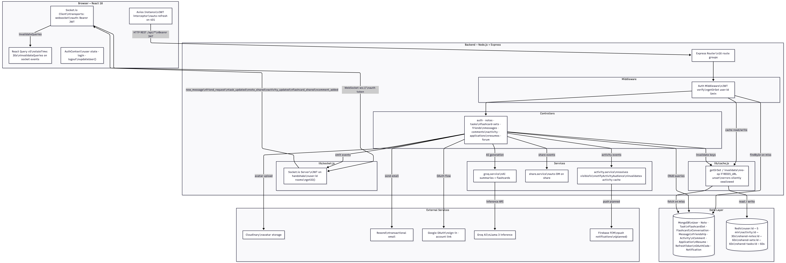
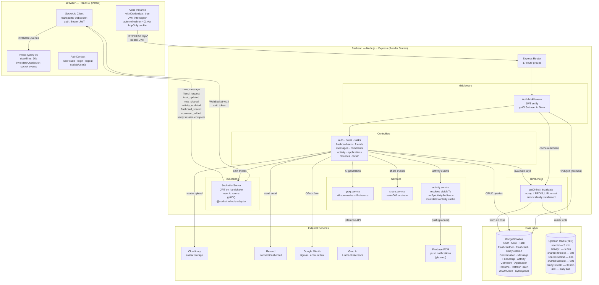
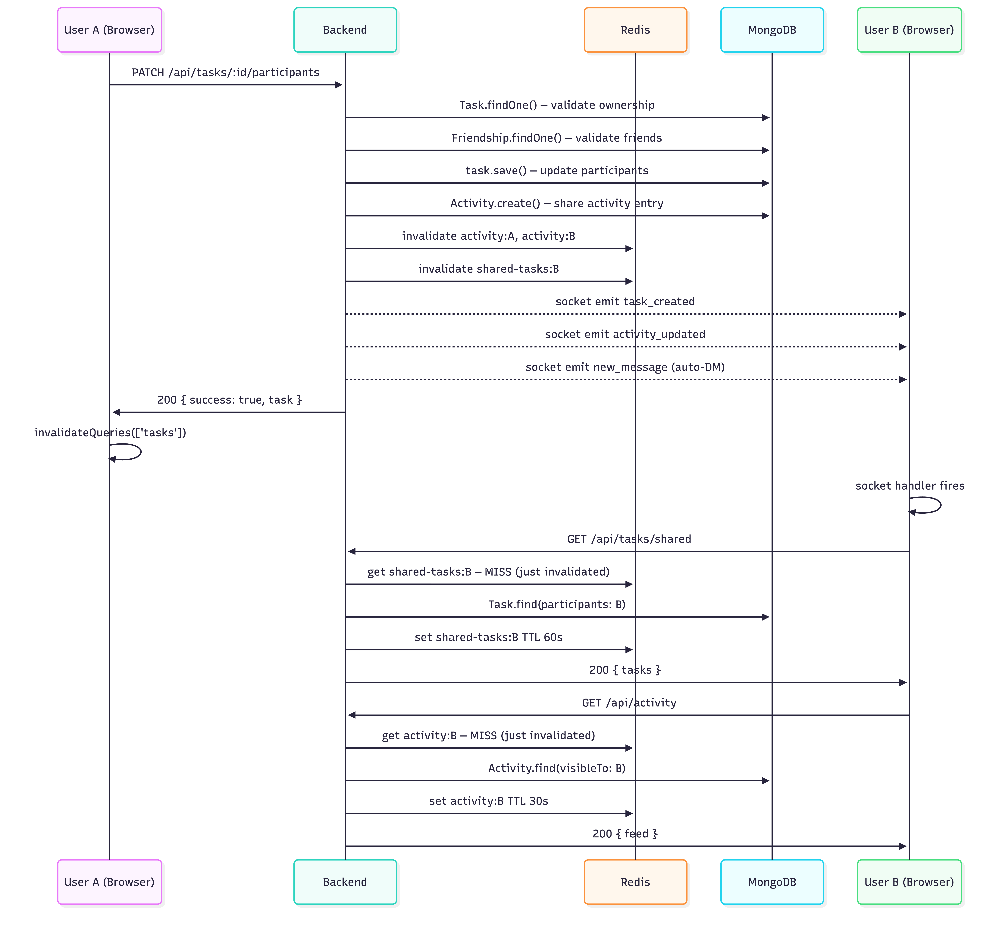
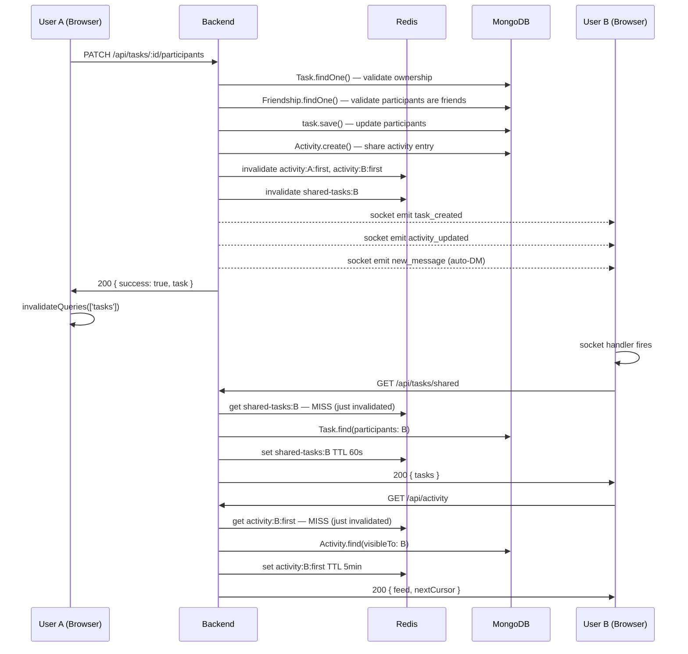
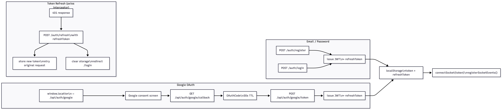
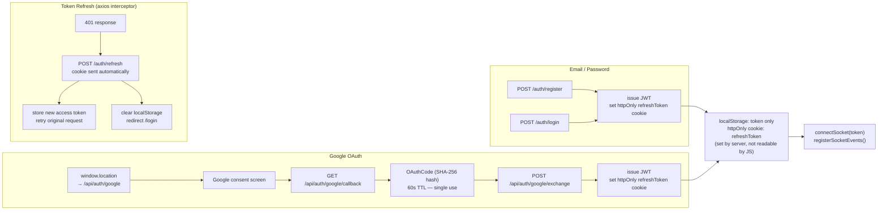
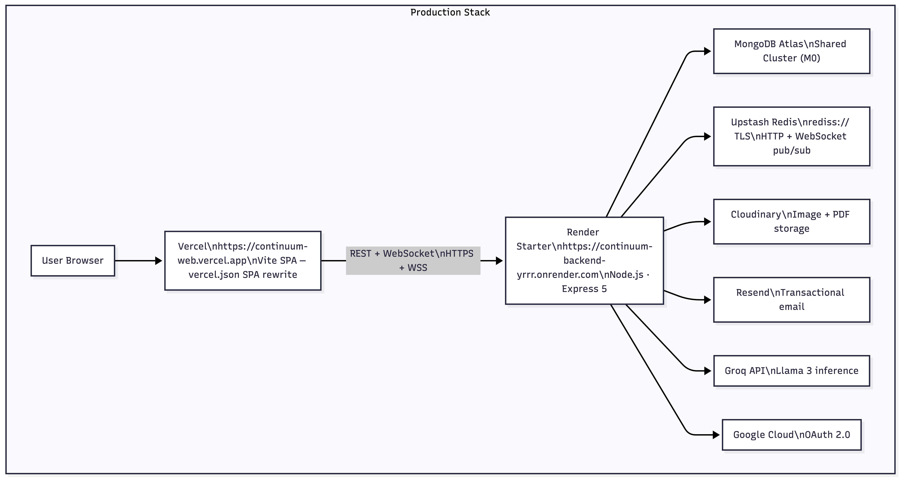
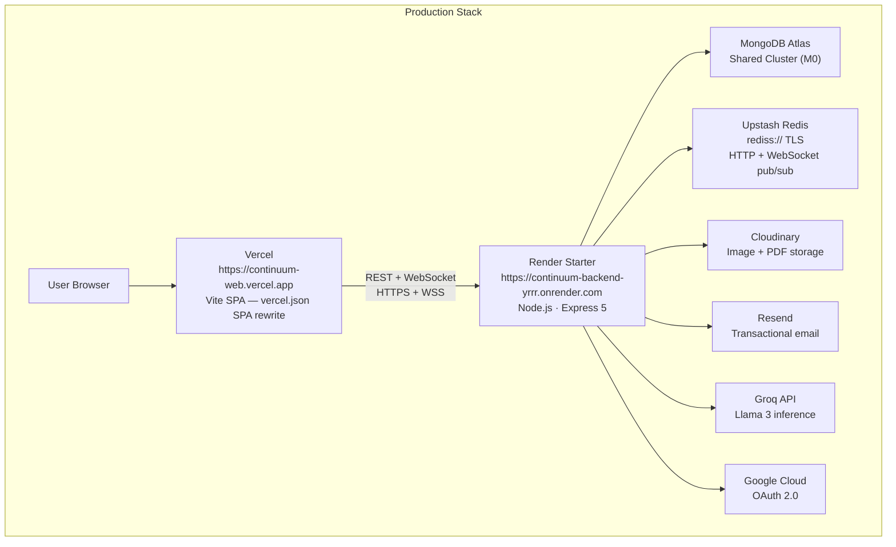
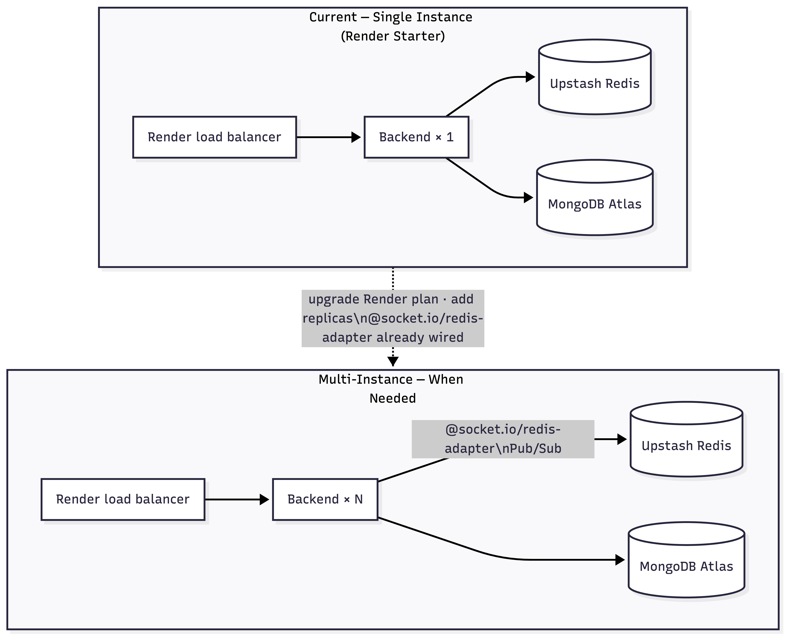
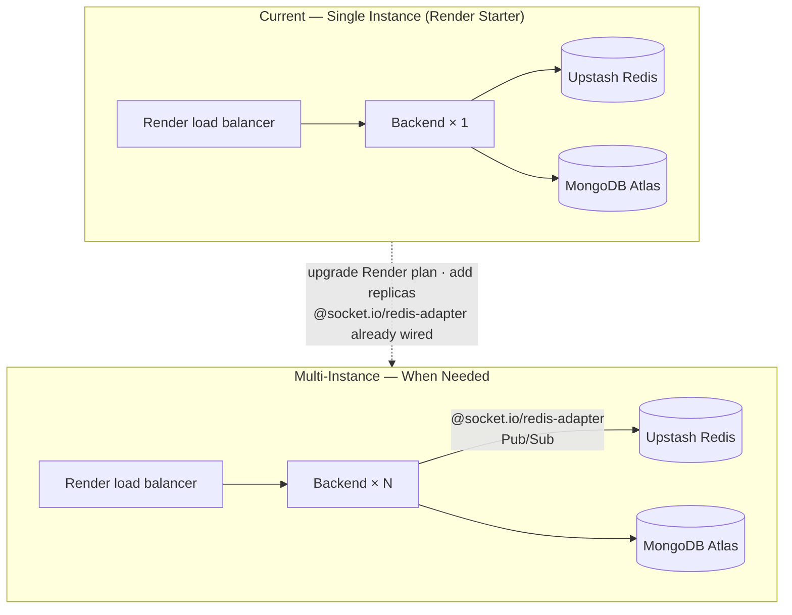

# Continuum — System Design Diagram

View at [mermaid.live](https://mermaid.live) or in VS Code with the Mermaid extension.

---

## Write + Real-Time Flow

Shows what happens when User A shares a task with User B.

---

## Auth Flow

---

## Production Deployment

| Service | Plan | URL |
|---------|------|-----|
| Frontend | Vercel Hobby | https://continuum-web.vercel.app |
| Backend | Render Starter | https://continuum-backend-yrrr.onrender.com |
| Database | MongoDB Atlas M0 (free) | Atlas cloud console |
| Cache / Pub-Sub | Upstash Redis (free) | `rediss://` TLS endpoint |
| Storage | Cloudinary (free) | — |
| Email | Resend (free) | — |
| AI | Groq API (free) | — |

---

## Scaling Path

