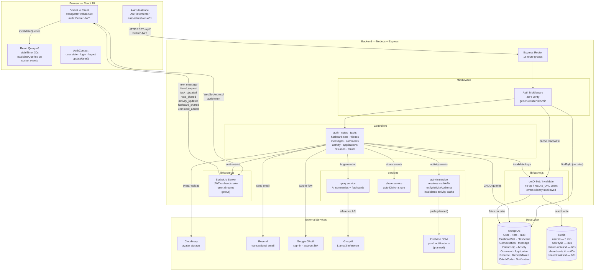
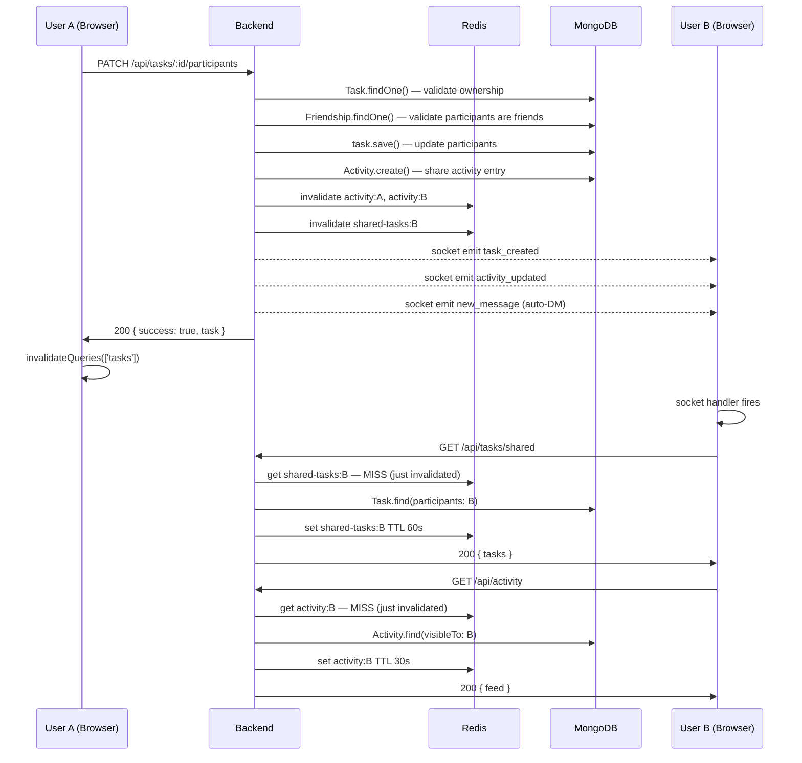
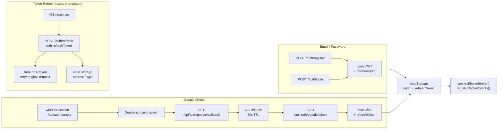
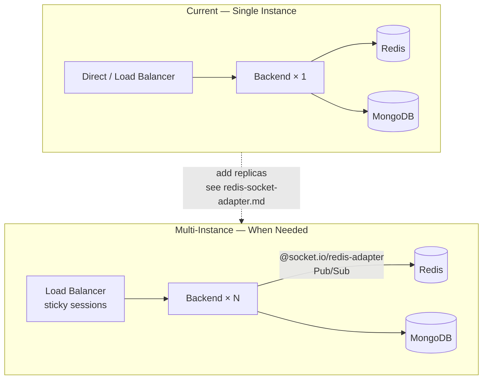

# Continuum — System Design Diagram

View at [mermaid.live](https://mermaid.live) or in VS Code with the Mermaid extension.

---

## Write + Real-Time Flow

Shows what happens when User A shares a task with User B.

---

## Auth Flow

---

## Scaling Path

