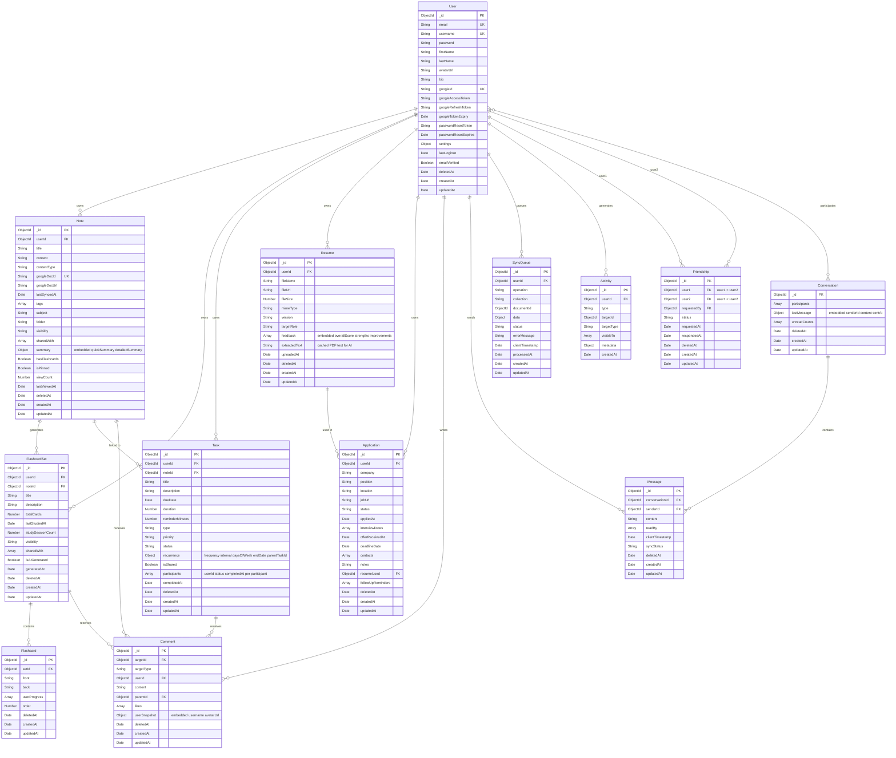

# Continuum Database Schema Diagram

View this diagram at [mermaid.live](https://mermaid.live) or in VS Code with Mermaid extension.

## Quick Reference

### Collections by Category

| Category | Collections | Must-Ship |
|----------|-------------|-----------|
| Auth | User | Yes |
| Notes | Note (summary embedded) | Yes |
| Learning | FlashcardSet, Flashcard | Yes |
| Tasks | Task | Yes |
| Social | Friendship, Comment | Yes |
| Career | Resume (feedback embedded), Application | Yes |
| Messaging | Conversation, Message | Stretch |
| Offline | SyncQueue | Stretch |
| Feed | Activity | Stretch |

**Total: 13 collections (9 must-ship + 4 stretch)**

### What Changed (Consolidation)

| Before | After | Why |
|--------|-------|-----|
| Note + NoteSummary (2 collections) | Note with embedded `summary` field | 1:1 relationship, always viewed together |
| Resume + ResumeFeedback (2 collections) | Resume with embedded `feedback[]` array | 1:few relationship, always viewed together |
| `passwordHash` field name | `password` field (hashed via pre-save) | Clearer naming — field stores plain input, hook hashes it |

### Key Relationships

- **User-centric**: Every collection references `userId` for ownership
- **Note hub**: Notes link to flashcards, tasks, and comments. Summary is embedded.
- **Resume hub**: Resumes link to applications. Feedback is embedded.
- **Soft deletes**: All collections have `deletedAt` for recovery
- **Denormalized**: `lastMessage` in Conversation, `userSnapshot` in Comment, `summary` in Note, `feedback` in Resume

### Relationship Types

- `||--o{` = One to Many (User has many Notes)
- `}o--o{` = Many to Many (Users in Conversations)
